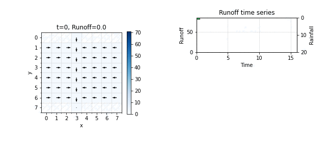

# Time-area diagram and the unit hydrograph

Author: Kristian Förster

This repository includes a [Jupyter notebook](Time-area-diagram.ipynb) that demonstrates the theory underlying the time-area diagram and the unit hydrograph. Together with a tutorial with active student involvment (see Schulz et al., 2018), this Jupyter notebook is provided as teaching material in the course "Urban Hydrology" at Leibniz Universität Hannover.

*Figure: Example demonstrating how the the hydrological response relates to the time-area diagram.*

**References**

Schulz, K., Burgholzer, R., Klotz, D., Wesemann, J. and Herrnegger, M.: Demonstrating the “unit hydrograph” and flow routing processes involving active student participation - a university lecture experiment, *Hydrology and Earth System Sciences*, 22(4), 2607–2613, https://doi.org/10.5194/hess-22-2607-2018, 2018.
